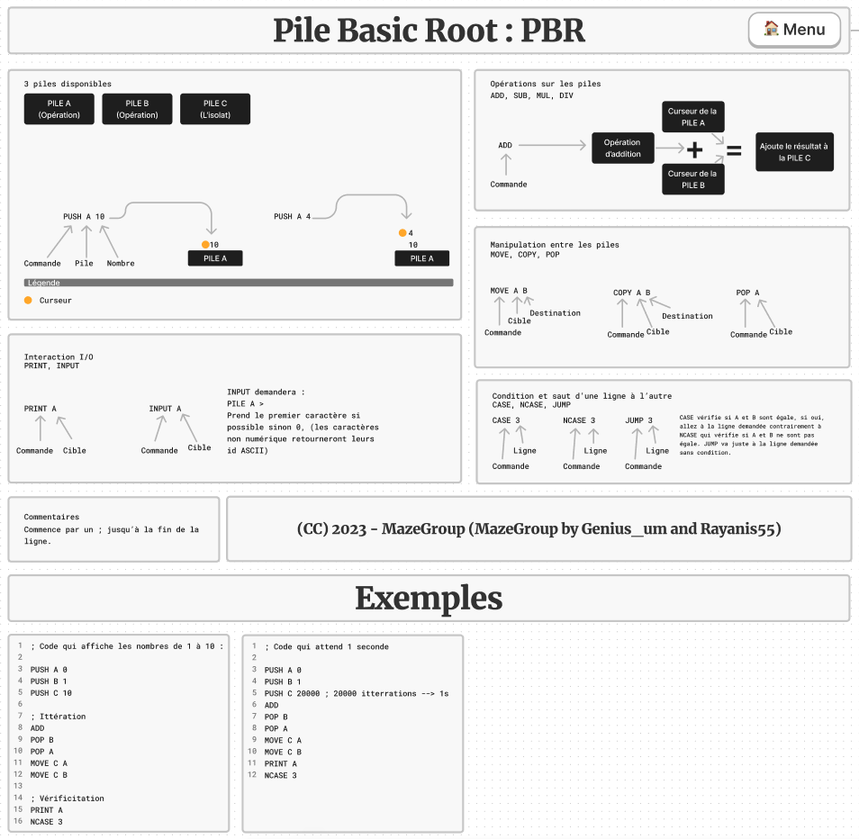

# PBR Programming Language
## A basical interpreted turing language made in Python
Doc of FigJam :

(In FRENCH)

## Documentation  (English) :
The PBR was made for be very minimal (only 14 instructions). It's a stack based langage who works with piles (only 3 piles). The syntax are simple but programs are headache. It's a fast interpreted language made in Python.

### Run programs
Run `python pbr.py <.pbr input file> <options : -l for logs>` on your terminal.

### Syntax
One line, one instruction. You can write instructions in uppercase like in microcomputers or just in lowercase.

### Comments
This time, comments are very important in this language, it's the only way to navigate it. Some comments examples :
```asm
; I'm a comment (one-line only supported)
INSTRUCTION ; I'm a comment after an instruction
```

### Values
There is only one value type : integers. If you put a char at the place of a integer value, it will be converted in integer with it ASCII code.

### Piles available
There are 3 piles : the pile A and B for operations and the pile C for operations results or values isolation.

### Piles manipulation
`PUSH <pile> <value (only one)>` to append a value on the pile selected.

`POP <pile>` to pop a value on the pile selected, just remove the last value nothing else.

`MOVE <pile 1> <pile 2>` to move the last value of the pile 1 to the pile 2.

`COPY <pile 1> <pile 2>` to copy the last value of the pile 1 to the pile 2.

### Calculations with piles
`ADD` to additionate the last values of the pile A and the pile B and append the result to the pile C, the two elements from the calcul will be removed to their piles.

Same for `SUB` to substract, `MUL` for multiply and `DIV` for divide.

### Console interactions
`PRINT <pile>` to print the last value of the selected pile.

`INPUT <pile>` to append the user input, with the same rules than values, to the selected pile.

### Lines interactions and conditions
`JUMP <line>` to jump to the line selected in the source code.

`CASE <line>` to jump to the line selected if the last values of the pile A and the pile B are equal.

`NCASE <line>` to make the same thing than `CASE` but the condition is if they aren't equal.

### End and example
So now than you learn how this language works, at your turn. Here is a example :
```
; Code who enumerate numbers from 1 to 10

PUSH A 0
PUSH B 1
PUSH C 10

; Itteration
ADD
POP B
POP A
MOVE C A
MOVE C B

; Show number and restart if it's not equal to the limit
PRINT A
NCASE 3
```
